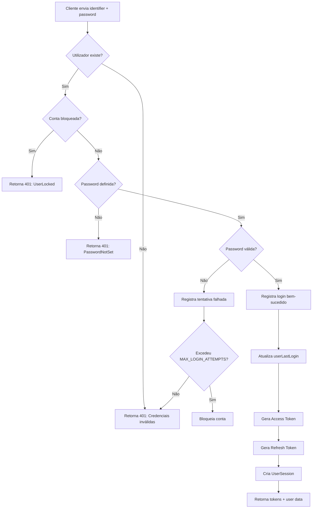

# Sistema de Autenticação - Fricon Core API

## 📋 Visão Geral

Sistema completo de autenticação JWT com suporte a login por **username ou email**, validação de passwords com bcrypt, tracking de tentativas de login, e bloqueio automático de contas.

---

## 🚀 Funcionalidades Implementadas

### ✅ **Autenticação**

- Login com username OU email
- Validação de password com bcrypt
- Geração de JWT tokens (access + refresh)
- Session tracking no banco de dados

### ✅ **Segurança**

- Password hashing com bcrypt (configurável)
- Tracking de tentativas de login (sucesso e falhas)
- Bloqueio automático após N tentativas falhadas
- Account lockout configurável
- Password history

### ✅ **Casos Especiais**

- **Password não definida**: Retorna erro específico solicitando que o utilizador defina password
- **Conta bloqueada**: Retorna erro informando bloqueio
- **Credenciais inválidas**: Registra tentativa e verifica se deve bloquear

---

## 📡 Endpoints Disponíveis

### **1. Login**

```http
POST /api/v1/auth/login
Content-Type: application/json

{
  "identifier": "joao.silva",  // Pode ser username OU email
  "password": "senha123"
}
```

#### **Resposta de Sucesso (200)**

```json
{
  "accessToken": "eyJhbGciOiJIUzI1NiIsInR5cCI6IkpXVCJ9...",
  "refreshToken": "eyJhbGciOiJIUzI1NiIsInR5cCI6IkpXVCJ9...",
  "user": {
    "userId": 1,
    "username": "joao.silva",
    "email": "joao@fricon.com",
    "firstname": "João",
    "lastname": "Silva",
    "roles": ["user", "admin"]
  }
}
```

#### **Erro: Password não definida (401)**

```json
{
  "statusCode": 401,
  "message": "Password não definida",
  "error": "PasswordNotSet",
  "description": "Este utilizador ainda não tem password definida. Por favor, defina a sua password antes de fazer login.",
  "action": "SET_PASSWORD_REQUIRED"
}
```

#### **Erro: Conta bloqueada (401)**

```json
{
  "statusCode": 401,
  "message": "Conta bloqueada",
  "error": "UserLocked",
  "description": "Esta conta foi bloqueada devido a múltiplas tentativas de login falhadas. Entre em contacto com o administrador."
}
```

#### **Erro: Credenciais inválidas (401)**

```json
{
  "statusCode": 401,
  "message": "Credenciais inválidas"
}
```

---

### **2. Obter Perfil (Requer Autenticação)**

```http
GET /api/v1/auth/profile
Authorization: Bearer {accessToken}
```

#### **Resposta de Sucesso (200)**

```json
{
  "message": "Profile do utilizador autenticado",
  "user": {
    "userId": 1,
    "username": "joao.silva",
    "email": "joao@fricon.com",
    "firstname": "João",
    "lastname": "Silva",
    "roles": ["user", "admin"]
  }
}
```

---

## 🔧 Configuração

### **Variáveis de Ambiente**

```bash
# JWT Configuration
JWT_SECRET=your-super-secret-jwt-key-min-32-characters-required
JWT_ACCESS_TOKEN_EXPIRATION=15m
JWT_REFRESH_TOKEN_EXPIRATION=7d

# Authentication Security
BCRYPT_ROUNDS=10                # Rounds para bcrypt hashing
MAX_LOGIN_ATTEMPTS=5            # Máximo de tentativas antes de bloquear
LOCKOUT_DURATION=900000         # Duração do bloqueio em ms (15 min)
```

---

## 🛡️ Como Funciona

### **1. Fluxo de Login**



### **2. Proteção de Rotas**

Todas as rotas são **protegidas por padrão** com JWT, exceto as marcadas com `@Public()`:

```typescript
// Rota pública (sem autenticação)
@Public()
@Post('login')
async login(@Body() loginDto: LoginDto) {
  return this.authService.login(loginDto);
}

// Rota protegida (requer JWT)
@Get('profile')
async getProfile(@CurrentUser() user: any) {
  return user;
}
```

### **3. Decorators Disponíveis**

- **`@Public()`**: Marca rota como pública (sem autenticação)
- **`@CurrentUser()`**: Injeta dados do utilizador autenticado

```typescript
@Get('me')
async getCurrentUser(@CurrentUser() user: any) {
  // user contém: { userId, username, email, firstname, lastname, roles }
  return user;
}
```

---

## 🧪 Testar Localmente

### **1. Iniciar a aplicação**

```bash
# Desenvolvimento
npm run start:dev

# Ou com Docker
docker-compose up -d
```

### **2. Testar Login com cURL**

#### **Login com username:**

```bash
curl -X POST http://localhost:3000/api/v1/auth/login \
  -H "Content-Type: application/json" \
  -d '{
    "identifier": "joao.silva",
    "password": "senha123"
  }'
```

#### **Login com email:**

```bash
curl -X POST http://localhost:3000/api/v1/auth/login \
  -H "Content-Type: application/json" \
  -d '{
    "identifier": "joao@fricon.com",
    "password": "senha123"
  }'
```

#### **Testar rota protegida:**

```bash
# Substituir {TOKEN} pelo accessToken retornado no login
curl -X GET http://localhost:3000/api/v1/auth/profile \
  -H "Authorization: Bearer {TOKEN}"
```

---

## 📊 Modelos do Banco de Dados

### **User**

- `passwordHash` (nullable) - Hash bcrypt da password
- `userIsLocked` - Flag de bloqueio
- `userLastLogin` - Timestamp do último login

### **LoginAttempt**

- Registra todas as tentativas de login (sucesso e falhas)
- Usado para implementar account lockout

### **UserSession**

- Tracking de sessões JWT ativas
- Permite revogação de tokens

### **UserPasswordHistory**

- Histórico de passwords anteriores
- Previne reutilização de passwords

---

## 🔐 Segurança

### **Password Hashing**

- Usa bcrypt com salt rounds configurável
- Default: 10 rounds (pode ser ajustado via `BCRYPT_ROUNDS`)

### **JWT Tokens**

- **Access Token**: Curta duração (default 15 min)
- **Refresh Token**: Longa duração (default 7 dias)
- Assinados com secret key configurável

### **Account Lockout**

- Após N tentativas falhadas, a conta é bloqueada
- Contador reseta após período configurável
- Admin pode desbloquear manualmente

---

## 🚧 TODOs / Próximas Funcionalidades

- [ ] Implementar refresh token endpoint
- [ ] Capturar IP real dos requests (atualmente hardcoded '0.0.0.0')
- [ ] Implementar logout (revogação de tokens)
- [ ] Implementar password reset flow
- [ ] Adicionar MFA (Multi-Factor Authentication)
- [ ] Email verification
- [ ] Rate limiting nos endpoints de autenticação
- [ ] Audit logs detalhados

---

## 📚 Estrutura de Arquivos

```
src/modules/
├── auth/
│   ├── auth.module.ts              # Módulo principal
│   ├── auth.service.ts             # Lógica de autenticação
│   ├── auth.controller.ts          # Endpoints HTTP
│   ├── strategies/
│   │   ├── local.strategy.ts       # Validação username/password
│   │   └── jwt.strategy.ts         # Validação JWT tokens
│   ├── guards/
│   │   ├── local-auth.guard.ts     # Guard para Local Strategy
│   │   └── jwt-auth.guard.ts       # Guard para JWT Strategy
│   ├── decorators/
│   │   ├── public.decorator.ts     # Marca rotas públicas
│   │   └── current-user.decorator.ts # Injeta user nos controllers
│   ├── dto/
│   │   ├── login.dto.ts            # DTO de request
│   │   └── login-response.dto.ts   # DTO de response
│   └── exceptions/
│       ├── password-not-set.exception.ts
│       └── user-locked.exception.ts
│
└── users/
    ├── users.module.ts
    ├── users.service.ts            # CRUD + password management
    └── users.controller.ts
```

---

## ✅ Checklist de Implementação

- [x] UsersService com findByUsername/Email
- [x] Password hashing com bcrypt
- [x] AuthService com validação de credenciais
- [x] Local Strategy (username/email + password)
- [x] JWT Strategy (token validation)
- [x] Login endpoint
- [x] Exceções customizadas (PasswordNotSet, UserLocked)
- [x] Login attempt tracking
- [x] Account lockout automático
- [x] Session tracking
- [x] Guards e Decorators
- [x] Integração com AppModule

---

**🎉 Sistema de Autenticação pronto para uso!**
